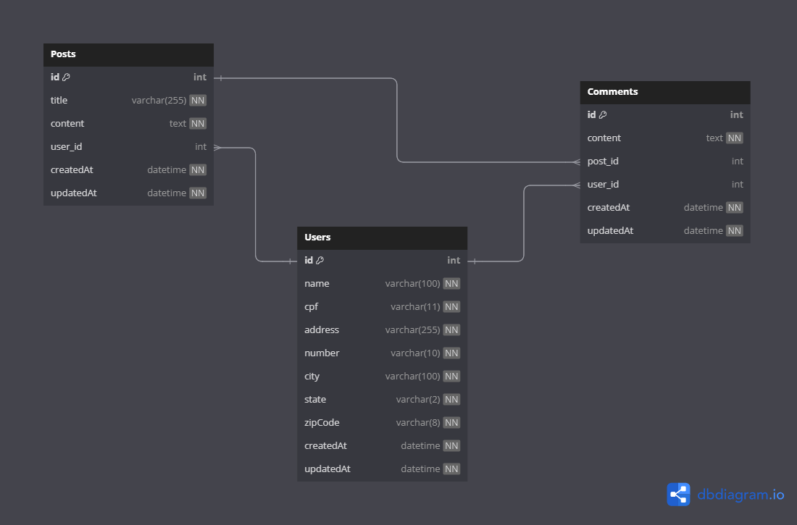

# api-smartnx

SmartNx Desafio Técnico - Desenvolvedor Back-end Jr

## Pré-requisitos

Antes de executar o projeto, certifique-se de ter as seguintes ferramentas instaladas:

- [Docker](https://www.docker.com/get-started)
- [Docker Compose](https://docs.docker.com/compose/install/)

## Configuração e Execução com Docker

### 1. Clone o repositório

```bash
git clone https://github.com/brennoviana/api-smartnx.git
```

### 2. Construção e execução dos containers

```bash
docker-compose up --build
```

### 3. Acessando a aplicação

Após iniciar os containers, a aplicação estará acessível em http://localhost:3000.

### 4. Parar e remover os containers

```bash
docker-compose down
```

## Modelagem do Banco de Dados

[](https://dbdiagram.io/d/66bf97728b4bb5230e533493)

## Postman Collection

Você pode baixar a collection do Postman para realizar as requests [aqui](docs/collection.json).

### Importar a Coleção no Postman

1. Abra o Postman.
2. Vá até "File" > "Import".
3. Selecione a aba "Upload Files".
4. Escolha o arquivo `.json` baixado.

### Configurando o Ambiente no Postman

1. No Postman, clique em "Environments" no painel à esquerda.
2. Clique em "Add" para criar um novo ambiente.
3. Nomeie o ambiente como `api-smartnx`.
4. Adicione uma nova variável chamada `url_server` e defina o valor como `http://localhost:3000` (ou outro valor que corresponda ao seu ambiente).
5. Adicione uma nova variável chamada `token`, onde você pode colar o token de autenticação obtido após o login.
6. Salve as mudanças.

### Passo a Passo: Criação de Usuário e Autenticação

Após iniciar a aplicação, você precisará criar um usuário e realizar o login para obter o token de autenticação que será utilizado nas demais rotas protegidas.

1. **Criação de Usuário**  
   Para criar um novo usuário, envie uma requisição POST para a rota `/users` com os seguintes campos no corpo da requisição:

**Exemplo de Requisição:**

POST {{url_server}}/users
Content-Type: application/json

```json
{
  "name": "Seu Nome",
  "cpf": "12345678900",
  "address": "Rua Exemplo",
  "number": "123",
  "city": "Cidade Exemplo",
  "state": "EX",
  "zipCode": "12345-678",
  "username" : "Seu username",
  "password" : "Sua senha"
}
```

2. **Login para Obter o Token**
Após criar o usuário, você precisará realizar o login para obter o token de autenticação. Envie uma requisição POST para a rota users/login com as credenciais de username e password.

**Exemplo de Requisição:**

POST {{url_server}}/users/login
Content-Type: application/json

```json
{
  "username": "Seu username",
  "password" : "Sua senha"
}
```

**Exemplo de Resposta:**

```json
{
  "token": "seu_token_aqui"
}
```

3. **Utilizando o Token nas Requisições**

Com o token em mãos, você pode realizar requisições para as rotas protegidas da aplicação. Para isso, inclua o token no cabeçalho de autorização da requisição:

**Exemplo de Cabeçalho:**

`Authorization: Bearer seu_token_aqui`

### Observações

O arquivo `.env` foi incluído no repositório para facilitar o uso e configuração do projeto. Ele contém as variáveis de ambiente necessárias para a execução do banco de dados MySQL e configurações do Node.js.
